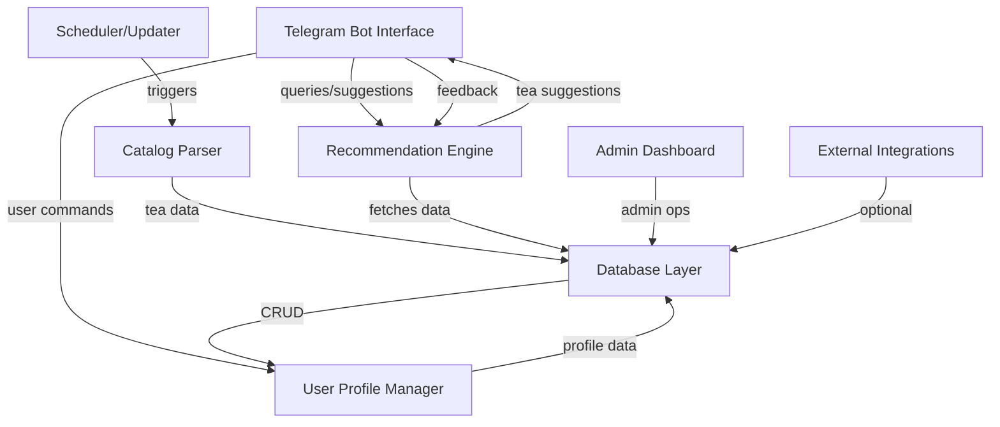
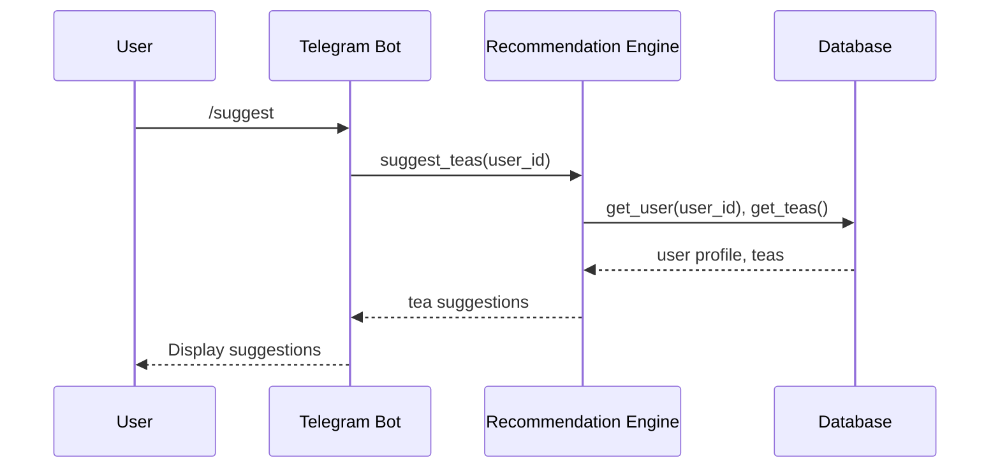
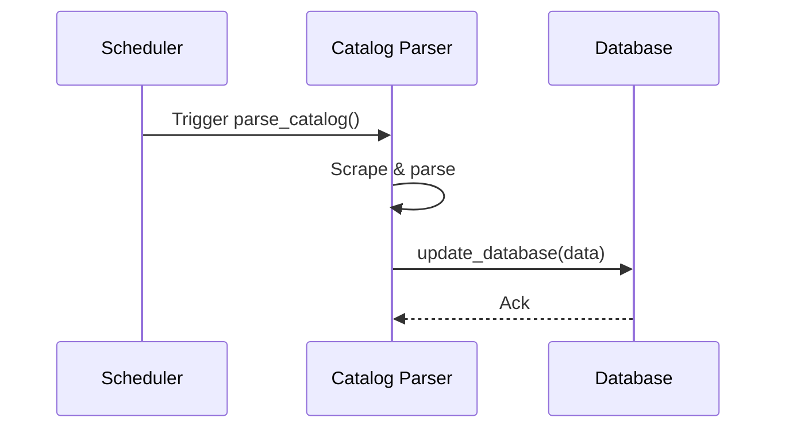

# Detailed Design Specification (DDS)

## 1. Introduction
This DDS describes the internal design of the Tea Suggester Telegram Bot, including all architectural modules, their responsibilities, interfaces, data models, and communication/data flow.

---

## 2. Architectural Overview

### 2.1. Main Modules
- Catalog Parser
- Database Layer
- Recommendation Engine
- Telegram Bot Interface
- User Profile Manager
- Scheduler/Updater
- Admin Dashboard (Future/Optional)
- External Integrations (Future/Optional)

### 2.2. High-Level Architecture Diagram

---

## 3. Module Design

### 3.1. Catalog Parser
- **Responsibilities:** Scrape and parse tea catalog from teashop.by, extract fields, update database.
- **Components:**
  - Web Scraper (requests/BeautifulSoup/Selenium)
  - Data Extractor/Transformer
  - Error Handling & Logging
  - Database Interface
- **Interfaces:**
  - `parse_catalog()`: Triggers parsing and returns structured data.
  - `update_database(data)`: Updates the database with parsed data.
- **Data Flow:**
  - Fetch HTML → Parse → Extract Data → Transform → Update DB

### 3.2. Database Layer
- **Responsibilities:** Store tea catalog, user profiles, preferences, history, feedback.
- **Components:**
  - PostgreSQL DB
  - ORM (SQLAlchemy or similar)
  - CRUD API
- **Schema:**
  - `teas(id, name, category, subcategory, description, price, packaging, image_url)`
  - `categories(id, name, parent_id)`
  - `users(id, telegram_id, preferences, history)`
  - `feedback(id, user_id, tea_id, rating, comment, timestamp)`
- **Interfaces:**
  - `add_tea(tea_data)`
  - `get_teas(query)`
  - `update_tea(tea_id, data)`
  - `delete_tea(tea_id)`
  - `add_user(user_data)`
  - `update_user(user_id, data)`
  - `get_user(user_id)`
  - `add_feedback(feedback_data)`
  - `get_feedback(tea_id)`

### 3.3. Recommendation Engine
- **Responsibilities:** Suggest teas based on user preferences/history, learn from feedback.
- **Components:**
  - Rule-based logic (initial)
  - ML-based logic (future)
  - Feedback loop
- **Interfaces:**
  - `suggest_teas(user_id)`: Returns list of recommended teas.
  - `process_feedback(user_id, tea_id, feedback)`: Updates recommendation logic.
- **Data Flow:**
  - Fetch user profile/history → Analyze → Query teas → Return suggestions

### 3.4. Telegram Bot Interface
- **Responsibilities:** User interaction, command processing, display results.
- **Components:**
  - Telegram Bot API integration
  - Command/Message Handler
  - Session/Context Manager
  - Multilingual Support
- **Interfaces:**
  - `handle_message(message)`: Processes incoming messages.
  - `send_message(user_id, text, options)`: Sends messages to users.
  - `register_user(user_id)`: Registers new users.
- **Data Flow:**
  - Receive message → Parse command → Call appropriate module → Send response

### 3.5. User Profile Manager
- **Responsibilities:** Manage user registration, preferences, history.
- **Components:**
  - Profile CRUD
  - Preference Updater
  - History Tracker
- **Interfaces:**
  - `create_profile(user_id, data)`
  - `update_preferences(user_id, preferences)`
  - `get_profile(user_id)`
  - `add_history(user_id, tea_id)`
- **Data Flow:**
  - Update/read user data in DB as needed

### 3.6. Scheduler/Updater
- **Responsibilities:** Schedule periodic catalog parsing and DB updates.
- **Components:**
  - Task Scheduler (APScheduler/cron)
  - Status Monitor
- **Interfaces:**
  - `schedule_task(task, interval)`
  - `run_task_now(task)`
- **Data Flow:**
  - Triggers parser at set intervals

### 3.7. Admin Dashboard (Future/Optional)
- **Responsibilities:** Admin management of catalog, users, analytics.
- **Components:**
  - Web Interface (Flask/Django)
  - Auth/Authorization
  - Analytics/Reporting
- **Interfaces:**
  - `admin_login(credentials)`
  - `view_stats()`
  - `manage_catalog()`
  - `manage_users()`

### 3.8. External Integrations (Future/Optional)
- **Responsibilities:** Payment/order systems, additional catalogs.
- **Components:**
  - API Clients
  - Data Adapters
- **Interfaces:**
  - `fetch_external_data()`
  - `send_order(data)`

---

## 4. Data Models

### 4.1. Tea
- id: int
- name: str
- category: str
- subcategory: str
- description: str
- price: float
- packaging: str
- image_url: str

### 4.2. Category
- id: int
- name: str
- parent_id: int (nullable)

### 4.3. User
- id: int
- telegram_id: str
- preferences: json
- history: json

### 4.4. Feedback
- id: int
- user_id: int
- tea_id: int
- rating: int
- comment: str
- timestamp: datetime

---

## 5. Sequence Diagrams

### 5.1. User Requests Tea Suggestion

### 5.2. Catalog Update

---

## 6. Security & Non-Functional Design
- Secure storage of user data (hashed IDs, encrypted sensitive fields)
- Input validation and sanitization
- Modular, well-documented codebase
- Multilingual support (RU/EN)
- Performance: <2s bot response, <10min catalog update
- Maintainability: Modular design, easy parser updates

---

## 7. Deployment
- Windows 10+
- Python (parser, bot, backend)
- PostgreSQL (local)
- Optional: Flask/Django for admin dashboard

---

## 8. Future Extensions
- Support for more tea shops
- Payment/order integration
- Advanced ML recommendations
- Web admin dashboard 